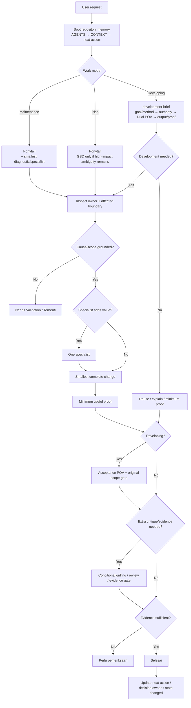

# Flow

Use this note as the single routing map. Detailed procedures remain in the
linked development, maintenance, foundation, and skill notes.

## Agent Routing Flow

## Conditional Escalations

- **GSD-style discovery** — only unresolved high-impact decisions after repo
  inspection.
- **Grilling** — adversarial challenge for a plan/decision/idea before
  commitment when useful.
- **CodeGraph** — optional broad source-navigation accelerator; never proof.
- **Code review** — only when independent critique materially adds value after
  implementation.
- **Evidence gate** — missing/disputed proof or repeatedly failing direction.
- **OpenSpec** — genuine cross-cutting contract/migration/multi-phase boundary.

None are default ceremony.

## Mode Outputs

- **Plan:** bounded decisions, acceptance criteria, and next action.
- **Developing:** grounded development brief, smallest required change or
  verified no-change result, minimum useful proof, Acceptance POV check, and
  concise result.
- **Maintenance:** diagnosis, minimal correction when required, and relevant
  regression proof.

## Continuity Rule

A new session resumes from `AGENTS.md` → `CONTEXT.md` → `next-action.md`.
Update `next-action.md` only when active state changed; durable reasons belong in
the decision log. Chat history is not the task tracker.

## Rule

- Keep this the only routing diagram.
- If routing changes, update this note and the activation matrix in the same
  bounded documentation task.
- This diagram does not replace `AGENTS.md`, `CONTEXT.md`, foundation policy, or
  the activation matrix.

## Related Notes

- [Development Flow](flows/development-flow.md)
- [Maintenance Flow](maintenance/maintenance-flow.md)
- [Knowledge Dashboard](index.md)
