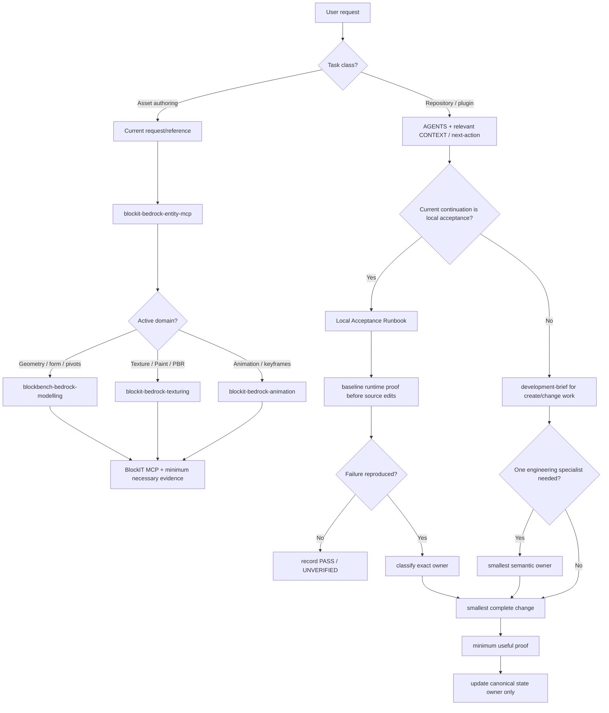

# Flow

Updated: 2026-08-11

Use this note as the repository **work-routing** map. Product modelling procedure is owned by `docs/foundation/03-modelling-workflow.md`; local acceptance procedure is owned by `operations/local-acceptance-runbook.md`.

## Task-Class Routing



## Asset Authoring Rule

Do not treat asset creation as repository Developing merely because it uses MCP tools. Normal asset work does not automatically load `CONTEXT.md`, `next-action.md`, `development-brief`, or the engineering review stack.

The orchestrator owns lane selection; specialists own domain procedure.

## Repository / Plugin Rule

For source/docs/CI/MCP/plugin changes:

```text
development-brief
+ at most one engineering specialist when it adds material domain procedure
```

Choose by semantic owner:

- MCP public/schema/result/registration/transport contract → `mcp-server-development`;
- Blockbench API/lifecycle/UI/Undo/runtime mechanics → `blockbench-runtime-development`;
- modelling policy/model judgement → `blockbench-bedrock-modelling`;
- TypeScript type-system failure → `typescript-type-safety`;
- Bun build/package/tooling failure → `bun-tooling`.

Do not stack specialists because multiple technologies appear in one file.

## Current Local Acceptance Route

When `next-action.md` points to local acceptance:

```text
AGENTS.md
→ CONTEXT.md
→ next-action.md
→ operations/local-acceptance-runbook.md
→ mcp/README.md + mcp/AGENTS.md
```

The baseline local run is evidence collection, not an invitation to redesign source. Reproduce/classify a failure before editing.

## Evidence Rule

Use the cheapest evidence that can falsify the current claim. Source/CI proof cannot upgrade a live Blockbench, visual, persistence, or client-exposure claim.

Material statuses remain:

```text
CURRENT-PROJECT VERIFIED
OFFICIALLY VERIFIED
LOCAL PROOF REQUIRED
UNSUPPORTED
UNKNOWN
```

## Continuity

- active repository status → `next-action.md`;
- local acceptance procedure → `operations/local-acceptance-runbook.md`;
- durable reason → decision log/decision owner;
- future/non-active work → task board.

Do not duplicate current status into reviews, roadmap, or history notes.

## Related

- [Minimal Navigation](minimal-nav.md)
- [Development Flow](flows/development-flow.md)
- [Skill Activation Matrix](skills/activation-matrix.md)
- [Implementation Map](implementation-map.md)
- [Knowledge Dashboard](index.md)
