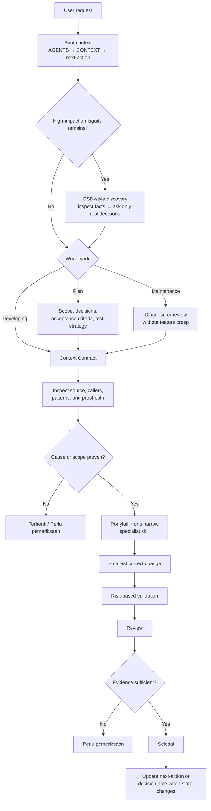

# Flow

Use this note as the single routing map for the agent and the user. Detailed
procedures remain in the linked foundation, development, maintenance, and
skill notes.

## Agent Routing Flow

## Conditional Stages

- **GSD-style discovery**: only before planning when the prompt leaves
  high-impact decisions unresolved. It does not create a second planning/state
  hierarchy in this repo.
- **Grilling**: when the user asks to stress-test a plan, decision, or idea.
  It challenges assumptions before commitment; it is not code review.
- **Code review**: after an implementation or existing diff needs critique.
- **Evidence gate**: when proof is missing, disputed, rejected, or a direction
  has failed repeatedly.
- **OpenSpec**: full lifecycle only when the change crosses the threshold in
  `decisions/open-spec-guide.md`.

These stages are conditional. Do not stack them into every task.

## Mode Outputs

- **Plan**: scope, decisions, acceptance criteria, test strategy, and next action.
- **Developing**: source or documentation change, validation, review, and result summary.
- **Maintenance**: diagnosis, minimal correction, regression proof, and limitations.

## Rule

- If the routing flow changes, update this note and the activation matrix in the
  same bounded documentation task.
- Keep it short enough to read in one pass.
- This is the only agent-routing diagram; do not create one per skill or folder.
- The diagram does not replace `AGENTS.md`, `CONTEXT.md`, foundation policy, or
  the activation matrix.

## Related Notes

- [Development Flow](flows/development-flow.md)
- [Maintenance Flow](maintenance/maintenance-flow.md)
- [Knowledge Dashboard](index.md)
