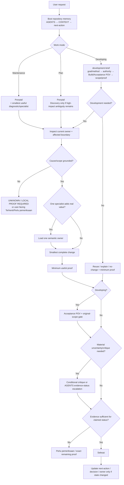

# Flow

Updated: 2026-08-08

Use this note as the single **agent work-routing** map. Product modelling flow is
owned by `docs/foundation/03-modelling-workflow.md`.

## Agent Routing Flow



## Developing Owner Budget

```text
development-brief
+ at most one useful specialist
```

Select by semantic owner, not implementation language:

- MCP public/input/result contract → `mcp-server-development`;
- Blockbench runtime/API/mutation mechanics → `blockbench-runtime-development`;
- Bedrock model judgement/visual result → `blockbench-bedrock-modelling`;
- TypeScript type-system issue → `typescript-type-safety`;
- Bun build/tooling issue → `bun-tooling`.

## Conditional Escalations

Only when needed:

- GSD-style discovery — unresolved high-impact requirement after repo inspection;
- `grilling` — adversarial plan/decision challenge;
- `code-review` — independent implementation critique;
- CodeGraph — optional navigation accelerator, never proof;
- OpenSpec — genuine cross-cutting contract/migration/multi-phase work;
- root evidence labels — `CURRENT-PROJECT VERIFIED`, `OFFICIALLY VERIFIED`,
  `LOCAL PROOF REQUIRED`, `UNSUPPORTED`, `UNKNOWN`.

None are default ceremony.

## Product Modelling Shortcut

For the current Bedrock architecture, use:

- [Modelling Workflow](../foundation/03-modelling-workflow.md)
- [Reference Fidelity Decision](decisions/reference-fidelity-loop.md)
- [Implementation Map](implementation-map.md)

Do not duplicate the modelling flow into this routing note.

## Continuity

New session:

`AGENTS.md` → `CONTEXT.md` → `next-action.md`

Update only the canonical owner whose state actually changed. Chat history is not
the task tracker.

## Related

- [Development Flow](flows/development-flow.md)
- [Maintenance Flow](maintenance/maintenance-flow.md)
- [Skill Activation Matrix](skills/activation-matrix.md)
- [Knowledge Dashboard](index.md)
