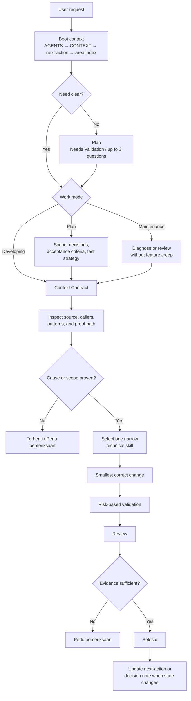

# Flow

Use this note as the single routing map for the agent and the user. Detailed
procedures remain in the linked foundation, development, maintenance, and
skill notes.

## Agent Routing Flow

## Mode Outputs

- **Plan**: scope, decision, acceptance criteria, test strategy, and next action.
- **Developing**: source or documentation change, validation, review, and result summary.
- **Maintenance**: diagnosis, minimal correction, regression proof, and limitations.

## Rule

- If the flow changes, update this note first.
- Keep it short enough to read in one pass.
- This is the only agent-routing diagram; do not create one per skill or folder.
- The diagram does not replace `AGENTS.md`, `CONTEXT.md`, foundation policy, or
  the activation matrix.

## Related Notes

- [Development Flow](flows/development-flow.md)
- [Maintenance Flow](maintenance/maintenance-flow.md)
- [Knowledge Dashboard](index.md)
